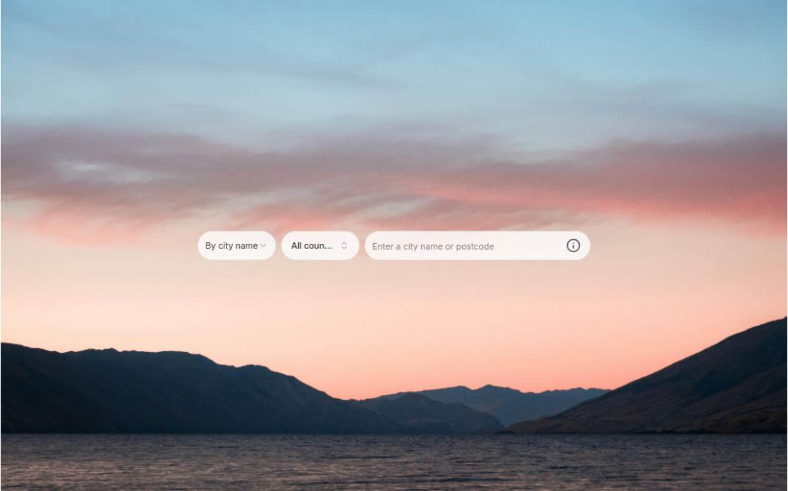

# Weather App

## Description

This Weather App allows users to view the current weather conditions for any city around the world. It leverages the OpenWeatherMap API to fetch real-time data.

## Demo

[Live Demo](https://weather-app-psi-gules-97.vercel.app/)

## Features

-   Search by city name or postcode
-   Display current weather for a specified location
-   Dynamic background and icon based on weather conditions
-   Responsive design

## Technologies Used

-   React
-   NextJS
-   OpenWeatherMap API

## Installation

1. Clone the repository: `git clone https://github.com/mingzhaoliang/weather-app.git`
2. Navigate to the project directory: `cd weather-app`
3. Install dependencies: `npm install`
4. Add a `.env.local` file to the project directory and specify the `OPENWEATHERMAP_API_KEY` with the API key from OpenWeatherMap
5. Start the development server: `npm run dev`
6. Open `http://localhost:3000` in your browser to view the app.

## Usage

-   There are two ways to get the weather data.
    -   Enter a city name
    -   Select "By postcode" and a country, and then enter a postcode

## API Reference

-   API: OpenWeatherMap
-   Endpoint:
    -   `GET /geo/1.0/zip?zip={zip code},{country code}&appid={API key}`
    -   `GET /geo/1.0/direct?q={city name},{state code},{country code}&limit={limit}&appid={API key}`
    -   `GET /data/2.5/weather?lat={lat}&lon={lon}&appid={API key}`

## Deployment

This app is deployed on Vercel.

## Acknowledgements

-   [OpenWeatherMap](https://openweathermap.org/api)
-   [React Documentation](https://reactjs.org/docs/getting-started.html)
-   [NextJS Documentation](https://nextjs.org/docs)
